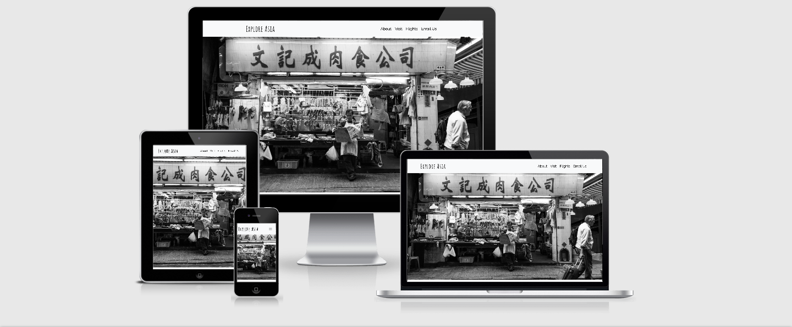

# Explore Asia 

This website was designed to help people gain knowledge about countries in Asia. The site is designed to be helpful in planning a holiday by
providing key information about the countries. Users have a way of looking for flights, of receiving information about restaurants and 
information about key attractions. The site can be interacted with by the user, allowing them to select which content they wish to read. 

The deployed site can be viewed [here.](https://ellyc20.github.io/ms2-explore-asia/) 

## UX 

### User Stories 
* I want to learn about countries in Asia, specifically about the languages or population.
* I would like to be able to look for flights while visiting the website. 
* I want to be able to find social media links, for further information.
* I want to use a map to see recommendations for where to eat.
* I want to use a map to see recommendations of things to see.

### Site Owner 
* I want to provide useful, factual information to the user.
* I want the site to be easy to use and aesthetically pleasing. 
* I want to ensure to include an option to look for flights, this benefits me as businesses may collaborate with me to generate sales. 

### Returning User 
* I want to be able to contact the site owner incase I require further information. 

### 1.Strategy 

**Project Purpose**

* To make planning a trip to Asia easier, by providing useful, helpful information. 
* To promote visting places or countries that people may not always consider. 
* To create a project that can be maintained and developed over time. 

### 2.Scope 

* To ensure that the site immediately showcases what it is about. 
* To have a straight forward interface, allowing the user to make choices about the content they wish to display.
* Ensure the layout is easy to use, not over complicated and to not overwhelm the user with design choices or features.

### 3.Structure 

* The site is organised into a single scrolling page, allowing the user to navigate to particular sections by using the navbar.
* The navbar is fixed allowing access at all points. 
* The opening section provides clear information about the users chosen country, immediately the user can make choices affecting the 
content displayed. 
* The sections have clear headers ensuring the user knows what information relates to what.
* The curved edges of buttons and certain elements add a softness to the site. 

### 4.Skeleton 

The wireframes for this project can be viewed [here](https://github.com/EllyC20/ms2-explore-asia/tree/master/wireframes/ms2-wireframes).

Throught the development process the design differed from the wireframes. As you can see, the Map API was moved to the right hand side, initally I did 
place it on the left but the page felt imbalanced and it didn't look good. In this section also you can see that initally I had wanted to use only 2 buttons, 
"Restaurants" and "Attractions", however I found it very hard to ensure that when the user clicked one of these buttons it only showed them the options relating 
to the country they had chosen. The user experience didn't feel very friendly as a user would have to scroll up to the 1st set of buttons, choose a country, 
scroll back down and then choose either button there to see options on the map. 

* A single scrolling pages 
* A footer with Social Media icons which take the user to an external site.

### 5.Surface 

**Colours**

* The colours were chosen as they provide an appealing user interface. The colours are soft to match the black and white photography. The 
orange colour chosen for the H1 elements provides a welcome pop of colour, as does the blue chosen for the Rest API Country data section alongside
the form. The blue chosen also ties into the provided colour of Google Map. 

**Font**

* The header font chosen is "Amatic Sc", the body font is "Raleway". I chose them as they pair very well together, a mix between a modern style header and a 
more traditional body text. 

**Images** 

* The main image I chose was due to the quality of the photo and the black and white feauture. The image represents a part of life in South East Asia, the 
focus being on markets in this image. Immediately the user can "see Asia" and what they might encounter on their visit. 

## Features 

### Current Features 

* A fixed Navbar, ensuring the user has access to the menu at all points.
* A single scrolling page, allowing ease of use to the user.
* A map, where the user chooses the destination via a button and is shown this location on the map. 
* The abilty to edit content, when the user selects a button the site is changed. The image displayed in "About" changes to reflect the users choice, as 
does the data shown. 
* The email feature allows emails to be sent to the site owner. 
* A flight information section, showing flights from Ireland to the chosen destination.

### Feautures To Be Implemented 

* An option to allow users to sign up for a monthly newsletter, that would provide up to date information regarding deals on hotels and flights.
* The flight section could be developed further with more knowledge and skills, it could be developed to provide a "search" function, allowing the user to choose
different flight paths. 
* The flight section could also have a calender search added, which could show dates where there are available flights. 
* In the future the site could be further developed to show all countries of Asia rather than a select few. The Rest Countries API could be adapted to show a dropdown
menu where a user could choose any country in Asia and recieve the data. This functionality could be added to Google Maps also, where any location could be searched and 
the user would see more results. 
* In future development the site could be developed to be a very informative app, allowing users to access information, maps, accommodation and restaurant recommendations / bookings 
alongside flight bookings. 

## Technologies Used 

### Languages Used 

* [HTML5](https://en.wikipedia.org/wiki/HTML5) - Provides the content and structure.
* [CSS3](https://en.wikipedia.org/wiki/CSS) - Provides styling to the project.
* [JavaScript](https://en.wikipedia.org/wiki/JavaScript) - Provides interactive elements to the site. 

### Frameworks And Libaries Used 

* [Git](https://git-scm.com/) - Used for version control. 
* [Bootstrap 4.5](https://getbootstrap.com/) - Used to create layout of this project.
* [Google Fonts](https://fonts.google.com/) - For the use of fonts. 
* [Font Awesome](https://fontawesome.com/) - For the Social Media icons in the footer.
* [Google Chrome Developer Tools](https://developers.google.com/web/tools/chrome-devtools) - Used throughout development for testing purposes.
* [Github](https://github.com/) - Used to store the project.
* [Gitpod](https://www.gitpod.io/) - Used to develop the project.
* [Github Pages](https://pages.github.com/) - Used to host the deployed site.
* [RAPID API](https://rapidapi.com/marketplace) - To access API endpoints for the Flight Search API, provided by Skyscanner.
* [Email JS](https://www.emailjs.com/) - To allow emails to be sent. 
* [Google Maps](https://developers.google.com/maps/documentation/javascript/overview) - For the map features seen on the site.
* [REST Countries](https://restcountries.eu/) - API used to provide data about chosen country. 

## Testing 

All testing can be viewed [here](https://github.com/EllyC20/ms2-explore-asia/blob/master/TESTING.md).

## Deployment 

### To Deploy this project, these are the steps taken: 

* All code was written using Gitpod, an online IDE.
* This code was pushed to Github and stored as a repositorie.
* To deploy I chose the repositorie to be deployed, then I entered the settings of this repo. 
* Within settings I scrolled down until I found the section titled "Pages". 
* In this section I selected "Master" as the branch, then saved.
* Once this is saved a link will be shown with the website deployed onto GitHub pages. 
* If you follow this link it will bring you to the deployed website. 

### To Clone: 

* You can run the code locally by cloning or downloading. 
* You click the code button within the repositorie and then select either clone or download. 
* If you choose to clone you will be provided with a URL. Copy the URL from the "Clone with HTTPS" section.
* In your IDE, open Git Bash.
* Type Git Clone and then paste the URL you copied. 
* Press enter and this will create the clone. 
* If you choose to download, you will be given a zip file.

## Credits 

### Content 

* The homepage "About" is written by me using facts from [Wikipedia](https://en.wikipedia.org/wiki/Southeast_Asia)
* The Map comes from [Google Maps API](https://developers.google.com/maps/documentation). 
* The Flight Data is provided by [Skyscanner API](https://rapidapi.com/skyscanner/api/skyscanner-flight-search).
* The Email functionality is provided by [EmailJS](https://www.emailjs.com/). 
* The Country Data is provided by [REST Countries API](https://restcountries.eu/).
* The changing image shown in the "About" section is created by me, using [Canva](https://www.canva.com/)

### Media 

* My homepage image is from Unsplash. The link can be found [here](https://unsplash.com/photos/WXKDnMFiYu8)
* My changing image is from [Canva](https://www.canva.com/), designed by me. 

### Acknowledgements 

* When implementing the Flight Search API, I referenced this [video](https://www.youtube.com/watch?v=tc8DU14qX6I&t=562s) to help understand how to do this. 
* I used [JSHint](https://jshint.com/) when working with JavaScript to check for errors.
* To the Code Institute course material, as the basis of all my knowledge is from here.
* To the Slack community as I have used the different channels to find answers and ask for advice.
* [Stack Overflow](https://stackoverflow.com/) as a general reference. 
* [W3Schools](https://www.w3schools.com/default.asp) as a general reference. 
* [Am I Responsive](http://ami.responsivedesign.is/) provides the image shown at the start of this README. 
* [Responsive Website Design Tester](https://www.responsivedesignchecker.com/) used to check how the site views on different devices.

