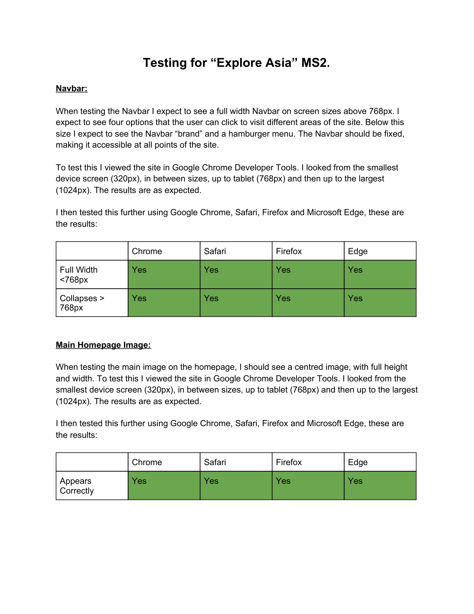
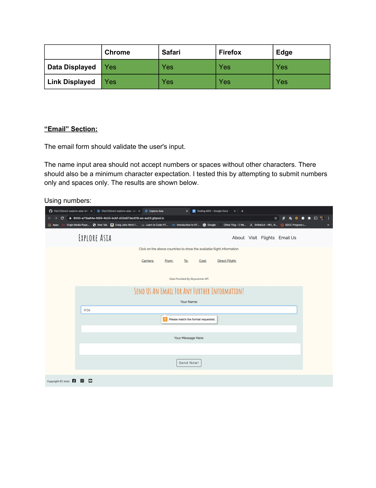
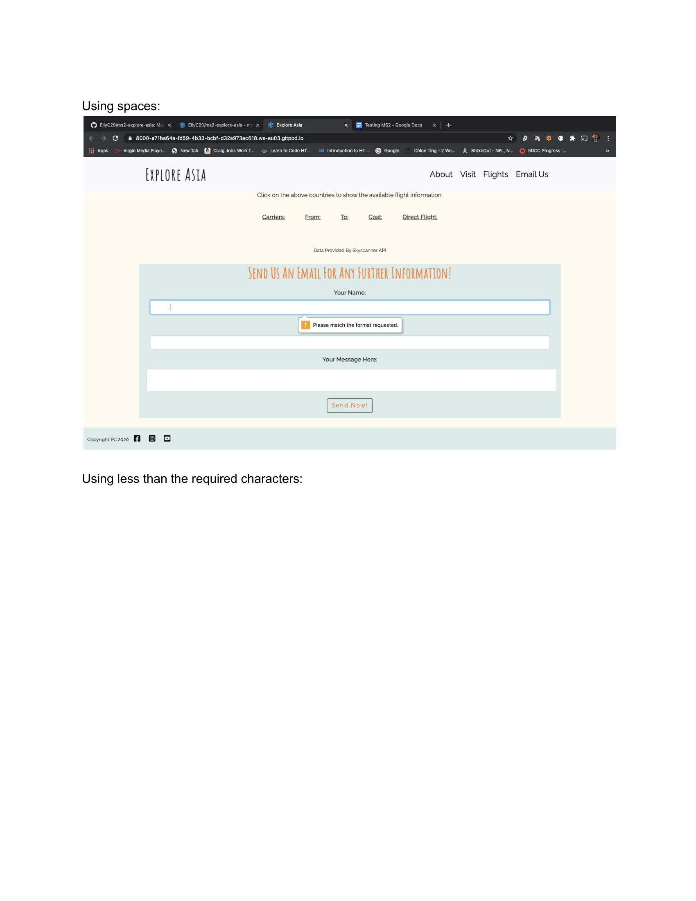
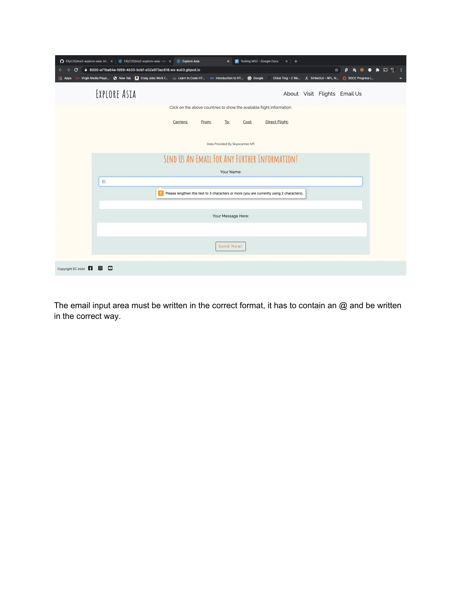
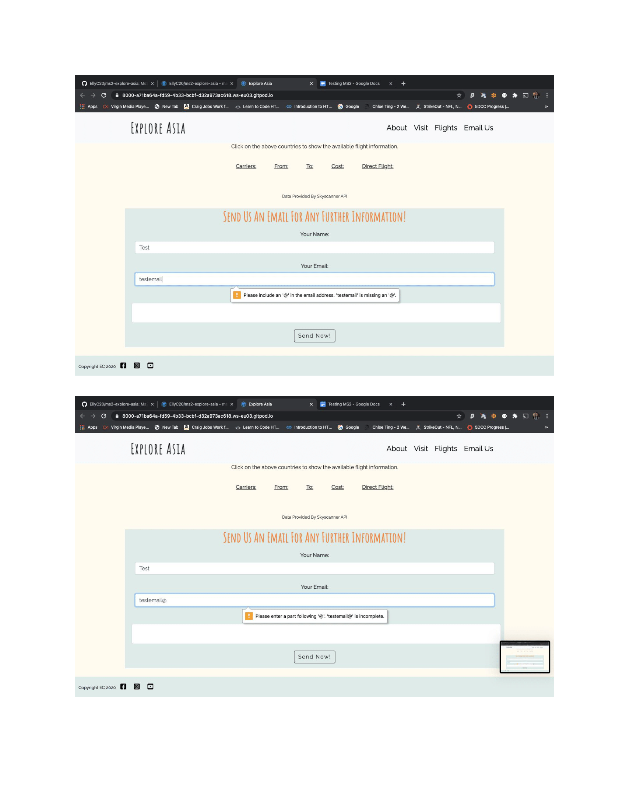
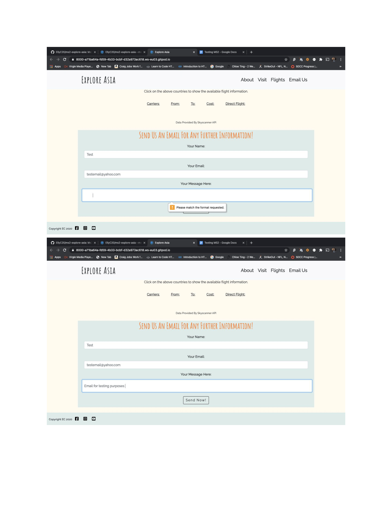
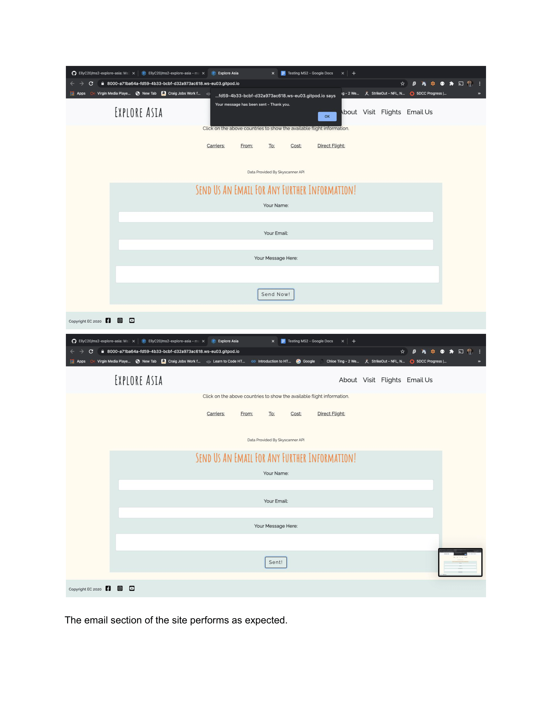
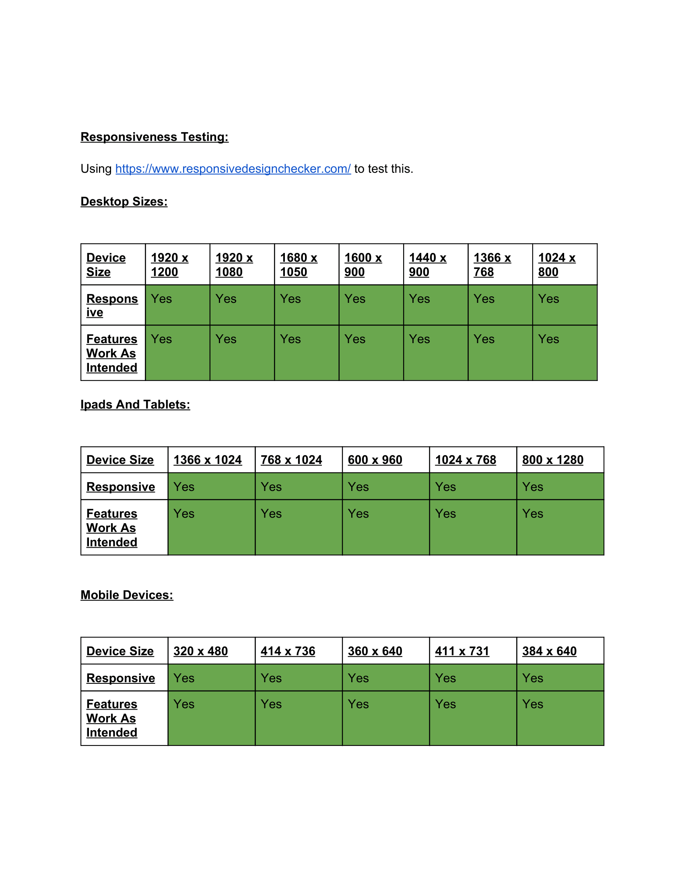

# Testing 

## Code Validity 

### HTML

When I initially ran my HTML through the Validity Checker found [here](https://validator.w3.org/), it returned an error on line 87. The error was due to a H1 tag having no content. 
The reason the H1 tag had no content was due to it being targeted by an event listener and text being added at that point. To ensure my HTML 
is vaild, I added a span with the class of "hidden" to add content to the H1 to ensure the error was resolved. By doing this, it allowed my code 
to function as intended also. 

### CSS 

I ran my CSS through the W3C CSS Validator found [here](https://jigsaw.w3.org/css-validator/), this returned no issues. 

### Javascript 

For Javascript I used JSHint, found [here](https://jshint.com/) I ran each JS file seperately and these were the results for each. 

* Email Js File 

* Image Change Js File  This showed a missing semi colon which I added in to the file.

* Map API Js File  A majority of this code was used from Google Map documentation and adapted for the project. The 
things being highlighted regarding variables are from Google's documentation on how to use their code. 

* Rest API Js File  This showed several missing semi colons, I added these to the file. The screenshot is 
after the semi-colons were added.

* Skyscanner Js File  As seen this showed 4 missing semi colons, I added these to the file. 

