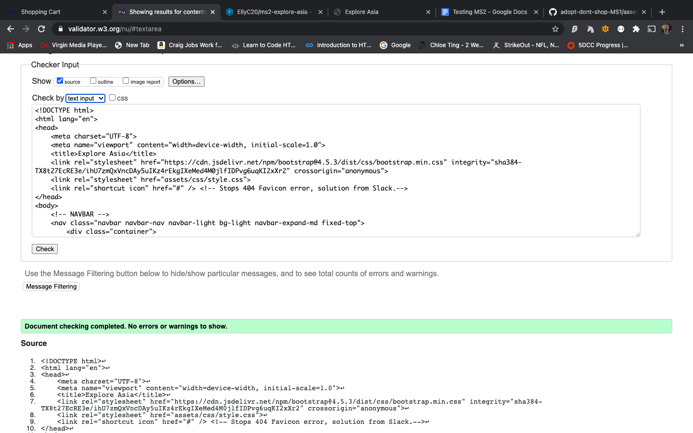

# Testing 

## Code Validity 

### HTML

When I initially ran my HTML through the Validity Checker, it returned an error on line 87. The error was due to a H1 tag having no content. 
The reason the H1 tag had no content was due to it being targeted by an event listener and text being added at that point. To ensure my HTML 
is vaild, I added a span with the class of "hidden" to add content to the H1 to ensure the error was resolved. By doing this, it allowed my code 
to function as intended also. 

